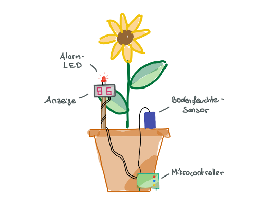
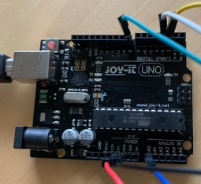
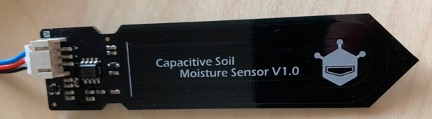
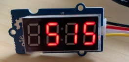
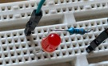
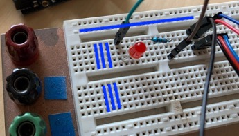
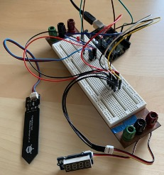
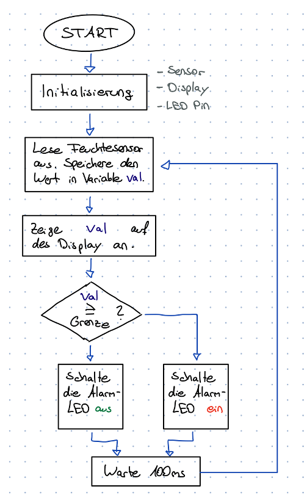
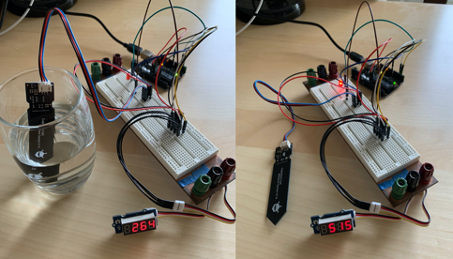

# System zum Ermitteln und Anzeigen der Bodenfeuchte einer Pflanze

Erstellt im Rahmen des Seminars Mikrocontroller an der TU Kaiserslautern.

## Inhaltsverzeichnis

1. [Zusammenfassung](#zusammenfassung)
2. [Verwendete Bauteile](#verwendete-bauteile)
3. [Schaltplan](#schaltplan)
4. [Software](#software)
5. [Inbetriebnahme des Systems](#inbetriebnahme-des-systems)
6. [Ideen für Erweiterungen des Systems](#ideen-für-erweiterungen-des-systems)
7. [Literaturverzeichnis](#literaturverzeichnis)

## Zusammenfassung

Heutzutage besitzen private Haushalte immer mehr Geräte mit Sensoren, Internetanbindung und Sprachassistenten. Dabei fällt oft das Schlagwort „Smart Home“. Die Benutzer können mit „Alexa“ sprechen, ihren Kühlschrank mit dem Smartphone bedienen oder das Haustier durch einen Tastendruck füttern. Hinter diesen Geräten steckt oft nicht mehr als ein paar Sensoren, Aktoren und ein Programm, welches für deren Zusammenspiel sorgt.
Im Folgenden wird ein Bodenfeuchtesensor mit Anzeige für Pflanzen gebaut. Dabei kann der Sensor in den Pflanzentopf gesteckt werden, um die Feuchte der Blumenerde zu ermitteln. Der aktuelle Feuchtigkeitswert kann an einem Display abgelesen werden. Außerdem leuchtet eine Alarm-LED auf, wenn die Erde zu trocken ist und die Pflanze gegossen werden muss.

Abbildung 1: Skizze des aufgebauten Systems

Mit der folgenden Dokumentation kann jeder mit Interesse an dem Thema ein Smart Home Pflanzen-Überwachungsgerät bauen. Die verwendeten Bauteile sind zudem sehr preiswert.

## Verwendete Bauteile

### Joy-IT Board

Abbildung 2: Arduino-Nachbau Joy-IT UNO R3

Das Joy-IT UNO R3 DIP Board ist ein Mikrocontroller Board basierend auf dem ATmega328P [1]. Es ist ein Nachbau des Open Hardware Produkts „Arduino UNO R3“. Deshalb kann beim Arbeiten mit dem Mikrocontroller Board die umfangreiche Dokumentation und das Forum des Arduino benutzt werden [2].
Der ATmega328P ist ein 8-Bit Mikrocontroller mit einer Taktfrequenz von 16 MHz. Auf dem Arduino Board sind außerdem ein Quarzkristall zur Taktgenerierung, eine USB Schnittstelle, ein linearer Spannungsregulierer, Pin-Stecker und weitere Peripherieelemente verbaut. Deshalb eignet sich der Arduino hervorragend zum Prototypenbau.
Auf dem Mikrocontroller kann ein eigenes Programm installiert werden. Mit dem Programm können dann Geräte an den angeschlossenen Steckern (Pins) gesteuert werden.
Die 6 Analog-Pins des Arduinos sind mit Analog-zu-Digital-Konvertern (ADK oder ADC) ausgestattet. Diese besitzen eine Auflösung von 10 Bit bei einer Eingangsspannung von 0 V bis 5 V. Diese Spannung wird also auf 2^10=1024 diskrete Werte abgebildet. Der Wertebereich reicht dementsprechend von 0 (0 V) bis 1023 (5 V).
Die 14 Digital-Pins können entweder als Eingang oder als Ausgang genutzt werden. Wenn sie als Ausgangspin betrieben werden, kann die Spannung an ihnen entweder auf 0 V oder auf 5 V gesetzt werden. Der maximale Ausgangsstrom pro Pin beträgt dabei 20 mA.
Das Programm wird in einem 32 KB großen Flash Speicher gesichert. Hinzu kommt ein 2 KB großer SRAM, in dem die Variablen gespeichert sind.

Spezifikation | Wert
--- | ---:
Empfohlene Eingangsspannung | 7 V – 12 V
Betriebsspannung | 5 V
Maximaler Ausgangsstrom pro digitalem Ausgang | 20 mA
Anzahl Digitale Ein-/ Ausgänge | 14
Anzahl Analoge Ein-/ Ausgänge | 6
Flash Speicher | 32 KB
SRAM | 2 KB

Tabelle 1: Spezifikationen Joy-IT R3 DIP [1]

### Bodenfeuchtesensor

Abbildung 3: Foto des Bodenfeuchtesensors von DFRobot

Der verwendete Bodenfeuchtesensor ist vom Hersteller DFRobot. Die Artikelbezeichnung lautet „Capacitive Soil Moisture Sensor SKU SEN0193“. Die Spezifikationen sowie eine Anleitung sind im DFRobot Wiki aufgelistet [3].
Die Messung erfolgt kapazitiv. Eine Eingangsspannung zwischen 3,3 V und 5 V wird benötigt. Dadurch wird die Kompatibilität zu vielen Mikrocontrollern sichergestellt.
Der Sensor gibt ein analoges Signal zwischen 0 V und 3 V aus. Je feuchter der Sensor ist, desto größer wird die Spannung.

Spezifikation | Wert
--- | ---:
Betriebsspannung | 3,3 V – 5 V
Ausgangsspannung | 0 V – 3 V
Betriebsstrom | 5 mA

Tabelle 2: Spezifikationen DFRobot Bodenfeuchtesensor

### Display

Abbildung 4: Anzeige der Zahl 515 auf dem Grove Display

Zum Anzeigen der Bodenfeuchte wird ein vierstelliges Display des Herstellers Seeed Studio verwendet. Die genaue Produktbeschreibung ist „Grove – 4-Digit Display“ [4].
Es handelt sich um vier 7-Segment Anzeigen mit einem Doppelpunkt zwischen der zweiten und dritten Zahl. Mit jeder 7-Segment Anzeigen kann eine Zahl von 0 bis 9 dargestellt werden. Zusammen kann also jede Zahl zwischen 0 und 9999 angezeigt werden.
Die LED Anzeige hat 12 Pins zur Steuerung. Auf dem Grove Display Board wird ein TM1637 LED Treiber benutzt. Damit reduziert sich die Anzahl der benötigten Steuerpins auf zwei [4].

Spezifikation | Wert
--- | ---:
Betriebsspannung |3,3 V – 5 V
Betriebsstrom |0,2 mA – 80 mA

Tabelle 3: Spezifikationen Grove - 4 Digit Display

### LED

Abbildung 5: Die LED und der dazugehörige Vorwiderstand

Eine Leuchtdiode wird als Alarm für trockenen Boden benutzt. Die LED kann entweder ein- oder ausgeschaltet werden. Im Aufbau wird sie dazu verwendet, dem Benutzer zu signalisieren, dass die Pflanze gegossen werden muss.
Es handelt sich um eine rote LED. Jede LED hat eine Anode und eine Kathode. Der Strom durch die LED muss von der Anode zur Kathode fließen, damit Licht abgegeben wird. Die Anodenseite hat meist ein längeres Bein. Die Kathodenseite der LED ist oft abgeflacht. Mit diesen zwei Hinweisen kann die richtige Orientierung herausgefunden werden.
Um den Strom durch die Leuchte zu begrenzen, wird ein 330 Ω Vorwiderstand verwendet. Beim Verdrahten der LED spielt es keine Rolle, ob der Widerstand auf der Anoden- oder Kathodenseite der LED angebracht wird.

Abbildung 6: Steckbrett mit in blau eingezeichneten Verbindungen

Zum schnellen Prototypenbau eignet sich ein Steckbrett. Dabei handelt es sich um ein Plastikbrett mit vorgefertigten Verbindungen und Steckern. Mit passenden Jumper Kabeln (siehe rechts auf Abbildung 6) können somit ohne Löten Verbindungen zwischen den Bauteilen hergestellt werden.
In Abbildung 6 sind die vorgefertigten Verbindungen in Blau eingezeichnet. Im mittleren Teil des Steckbretts liegen vertikale Verbindungen vor. Dabei sind die oberen von den unteren Reihen getrennt. Außen auf dem Steckbrett befinden sich je zwei lange horizontale Verbindungen.

## Schaltplan

Abbildung 7: Schaltplan

Der Arduino stellt das zentrale Element im Aufbau dar. Er versorgt die anderen Geräte mit Energie und auf ihm läuft das Programm.
Der Bodenfeuchtesensor benötigt eine Betriebsspannung von 5 V. Diese wird über das +5V und das GND Kabel (Masse = 0 V) bereitgestellt. Der Sensor gibt ein analoges Signal an seinem Pin AO aus. Dieses ist mit dem Analog-Pin A0 des Arduinos verbunden. An diesem Pin wird mit einem ADC (Analog-Digital Converter) der aktuelle Sensorwert ausgelesen.
Das Grove Display wird genauso wie der Bodenfeuchtesensor mit 5 V versorgt. Die Steuerung des Displays geschieht über die zwei Anschlüsse CLK (gelb) und DIO (weiß). Diese werden durch Kabel mit den digitalen Ausgängen D2 und D3 des Arduinos verdrahtet.
Die LED wird direkt mit dem benötigten Vorwiderstand verbunden. Der Widerstand wird dann mit dem Pin D8 des Arduino verbunden und die Leuchtdiode mit dem Masse-Kabel. Beim Einbau der LED ist die Orientierung wichtig. Die Anode muss auf der Widerstand-Seite liegen und die Kathode auf der Masse-Seite. Die Anodenseite hat meist ein längeres Bein. Wird die LED umgekehrt eingebaut leuchtet sie nicht.

Abbildung 8: Der komplette Aufbau

## Software

### Die Entwicklungsumgebung

Zum Programmieren des Arduinos wurde das Arduino IDE benutzt. Dabei handelt es sich um ein quelloffenes Programm, das geschriebene Software in Maschinencode übersetzt und dann in den Programmspeicher des Arduinos lädt [2].
Die im Arduino IDE verwendete Programmiersprache ist ähnlich zu C und C++. Im Internet werden zahlreiche quelloffene Bibliotheken angeboten, mit denen die meisten Bauteile in Betrieb genommen werden können.
Das Arduino Board wird per USB Kabel an den Computer angeschlossen. Im Arduino IDE wird dann die passende Arduino Bezeichnung und der angeschlossene USB Port ausgewählt. Da der Joy-IT R3 ein Nachbau des Arduino UNO ist, wird dieser unter Tools>Board ausgewählt.
Mit einem Klick auf „Upload“ übersetzt das Arduino IDE das geschriebene Programm in Maschinencode und lädt es auf den Arduino. Nach einem automatischen Reset beginnt dieser mit der Ausführung des Programms.

### Flussdiagramm des Programms

Abbildung 9: Flussdiagramm des Programmablaufs

Wie im Flussdiagramm in Abbildung 9 zu sehen beginnt die Programmroutine mit der Initialisierung der verbundenen Komponenten. Dabei findet die Zuordnung zwischen den Pins und den daran angeschlossenen Geräten statt. Alle Pins, an denen eine Spannung gelesen wird, müssen außerdem als Eingang definiert werden. Das Display benötigt eine eigene Initialisierungsroutine, die von einer externen Bibliothek übernommen wird.
Nach der Initialisierung beginnt die Hauptschleife des Programms. Zu Beginn wird der aktuelle Wert des Feuchtesensors ausgelesen. Es resultiert eine Zahl zwischen 0 und 1023, die den aktuellen Sensorwert repräsentiert. Dieser Sensorwert wird in der Variablen „val“ gespeichert.
Als nächstes wird der Sensorwert auf dem Display angezeigt. Die Kommunikation zum Display übernimmt dabei hauptsächlich die Display Bibliothek.
Nachdem der Wert auf dem Display steht wird entschieden, ob die Alarm-LED an- oder ausgeschaltet wird. Dazu kann der Benutzer eine Grenze definieren. Sobald der Feuchtewert des Bodens über diesen Wert steigt, ist der Boden zu trocken und die Pflanze muss gegossen werden. Als Resultat wird dann die rote Leuchtdiode angeschaltet. Der Schwellwert muss zuvor experimentell ermittelt werden. Wenn „val“ also größer als der Schwellwert ist, wird die LED angeschaltet, ansonsten ausgeschaltet.
Zuletzt wird die Programmausführung für 100 ms pausiert bevor die Hauptschleife wieder von vorne beginnt.

### Verwendete Bibliotheken

Neben den Standard Arduino Befehlen wurde im folgenden Beispielprogramm eine Bibliothek zum Ansteuern des Displays verwendet [5]. Die Bibliothek ist kostenlos und quelloffen.

### Programm

Das gesamte Programm befindet sich im Git in der Datei `main.ino`.

Im Folgenden werden einige Schlüsselstellen im Programmablauf erklärt.

Der Programmcode beginnt mit Hinweisen auf die Funktionalität und den Ersteller des Programms. Wie alle anderen Zeilen, die mit „//“ beginnen wird dieser Teil des Programms beim Übersetzen in Maschinencode (kompilieren) ignoriert.
In Zeile 7 wird die externe Bibliothek „TM1637“ eingebunden. Sie wird zum Steuern des Displays benötigt. Es folgt die Zuordnung der Bauteile zu den Arduino Pins. Diese wird von Zeile 10 bis 13 in Variablen gespeichert. Da diese Variablen außerhalb einer Funktion deklariert werden, handelt es sich um globale Variablen. Diese sind zu nahezu jedem Zeitpunkt im Programmablauf abrufbar.
In den Zeilen 16 und 17 kann der Benutzer Einstellungen vornehmen. Die Variable „brightness“ stellt die Helligkeit des Displays ein. Dabei kann ein Wert von 0 bis 7 benutzt werden. Die Einstellung 0 bedeutet ein sehr dunkles Display, wogegen 7 die hellste Stufe darstellt. Je heller die Anzeige ist, desto mehr Strom benötigt sie. Die Variable „threshold“ setzt den Feuchtewert, über dem der Boden als zu trocken eingestuft wird und die Alarm-LED eingeschaltet wird. Dieser Wert wird experimentell festgelegt (siehe Inbetriebnahme des Systems).
In Zeile 21 wird das Display mit den vorher festgelegten Pins definiert.
Der Rest des Programms besteht aus zwei Funktionen, „setup“ und „loop“. Beim Starten des Arduinos wird die Funktion „setup“ einmal ausgeführt und die Funktion „loop“ daraufhin durchgehend wiederholt. Im „setup“ können also weitere Initialisierungen vorgenommen werden, wogegen die Hauptschleife des Programms in der „loop“ Funktion untergebracht wird.

Die Funktion „setup“ umfasst die Zeilen 23 bis 31.
Zuerst wird mittels der TM1637 Bibliothek das Display initialisiert (Zeile 24) und die gewünschte Helligkeit eingestellt (Zeile 25). Dann wird für zwei Sekunden eine Willkommensnachricht auf dem Display angezeigt (Zeile 27 und 28). Zuletzt wird in der „setup“ Funktion der LED Pin initialisiert (Zeile 30). Dabei wird mit dem Argument „OUTPUT“ angegeben, dass es sich um einen Ausgangs-Pin handelt.

Es folgt die „loop“ Funktion. Diese stellt die Hauptschleife des Programms dar.
In Zeile 35 wird der aktuelle Sensorwert des Bodenfeuchtesensors ausgelesen. Da es sich um eine analoge Messgröße handelt, geschieht dies mit der Funktion „analogRead(…)“. Der Sensorwert wird in der Variable „val“ gespeichert.
Daraufhin wird in Zeile 37 der Wert von „val“ aus dem Display angezeigt. Bei der Variable Display handelt es sich um ein Objekt. „displayNum“ ist eine Funktion, die zu diesem Objekt gehört (eine Methode). Deshalb wird sie mit „display.displayNum(…)“ ausgeführt. In Zeile 39 wird der Schwellwertvergleich mit einem „if“ Statement durchgeführt. Wenn „val  threshold“ ist, läuft das Programm in Zeile 40 weiter, ansonsten in Zeile 42. Die Zeilen 40 und 42 steuern mit der Funktion „digitalWrite(…, LOW/HIGH)“ die LED. Zuletzt sorgt die Funktion „delay(100)“ für eine Pause von 100 ms. Dann beginnt die Funktion „loop“ automatisch von vorne.

Nach dem Kompilieren des Programms ist es 2948 Byte groß. Damit belegt es weniger als 10 % des Verfügbaren Speicherplatzes des Arduinos.

## Inbetriebnahme des Systems

Zum Anschalten des Arduinos muss er mit einer Spannungsquelle verbunden werden. Dies kann zum Beispiel über die USB Schnittstelle geschehen. Sobald der Arduino mit Strom versorgt wird startet sofort der Programmablauf.
Wie erwartet wird zuerst die Willkommensnachricht „Hallo“ auf dem Display angezeigt. Manche Buchstaben müssen im Zusammenhang interpretiert werden, da nicht das ganze Alphabet mit einer 7-Segment Anzeige dargestellt werden kann.
Kurz danach wird auf dem Display der gemessene Feuchtewert angezeigt. Wenn der Sensor frei in der Luft hängt wurde in diesem Test ein Wert von etwa 515 angezeigt. Außerdem ist die LED angeschaltet, da der Wert 515 den vorher eingestellten Schwellwert von 450 überschreitet.
Als nächstes wurde der Sensor im Test in ein Glas Wasser gehalten. Auf dem Display wurde der Wert 264 angezeigt. Folglich handelt es sich um den niedrigsten Wert, der möglich ist. Die LED ist ausgeschaltet, da der Boden bereits nass genug ist und nicht gegossen werden muss.

Abbildung 11: Test des Systems. Links: Der Sensor ist nass, Rechts: Der Sensor ist trocken. Beachte die LED in den Bildern.

Als nächstes kann der Schwellwert zum Einschalten der Alarm-LED eingestellt werden. Dafür wird der Sensor in den Blumentopf gesteckt und die Pflanze gegossen. In den nächsten Tagen wird die Feuchte des Bodens und der Wert auf der Anzeige beobachtet. Sobald vermutet wird, dass die Pflanze gegossen werden muss, wird der aktuelle Feuchtewert notiert und im Programm eingetragen (Zeile 17).

## Ideen für Erweiterungen des Systems

Das System kann weiter verfeinert und ausgebaut werden. Zum Abschluss der Dokumentation werden drei weiterführende Ideen aufgelistet, durch die der Aufbau verbessert werden kann.

### Speichern der Daten

Wenn die Bodenfeuchte der Pflanze über einen langen Zeitraum überwacht werden soll , können die Daten permanent gespeichert werden. Das kann zum Beispiel auf einer SD Karte erfolgen. Mit einem entsprechenden SD Karten Modul und der dazugehörigen Bibliothek kann beispielsweise der Feuchtewert stündlich in eine Datei geschrieben werden. Die Werte können dann später am Computer ausgelesen und mit Excel ausgewertet werden.

### Automatisches Gießen

Um die Gartenarbeit noch weiter zu automatisieren, kann auch das Gießen vom Arduino übernommen werden. Die Logik dahinter ist ähnlich zu der bereits eingebauten Alarm-LED. Statt die LED anzuschalten kann für kurze Zeit eine Pumpe aktiviert oder ein Ventil geöffnet werden.

### Daten live abrufen

Die Bodenfeuchtewerte können am Smartphone oder sogar live im Internet dargestellt werden. Dafür müssen die Daten auf einem Webserver aufbereitet und freigegeben werden. Dazu kann zum Beispiel ein Raspberry Pi, ein Minicomputer mit Internetzugriff, benutzt werden.

## Literaturverzeichnis

[1] Joy-IT, „Joy-IT R3 Spezifikationen,“ [Online]. Available: <https://joy-it.net/de/products/ARD_R3DIP>.

[2] Arduino AG, „Arduino Webseite,“ [Online]. Available: <https://www.arduino.cc>.

[3] DFRobot, „DFRobot Wiki: Capacitive Soil Moisture Sensor,“ DFRobot, [Online]. Available: <https://wiki.dfrobot.com/Capacitive_Soil_Moisture_Sensor_SKU_SEN0193>. [Zugriff am 8 Juni 2020].

[4] Seeed Studio, „Seeed Studio Wiki: Grove - 4-Digit Display,“ [Online]. Available: <https://wiki.seeedstudio.com/Grove-4-Digit_Display/>. [Zugriff am 8 Juni 2020].

[5] Seeed Studio, „Grove 4-Digit Display Library,“ [Online]. Available: <https://github.com/Seeed-Studio/Grove_4Digital_Display>. [Zugriff am 9 Juni 2020].
